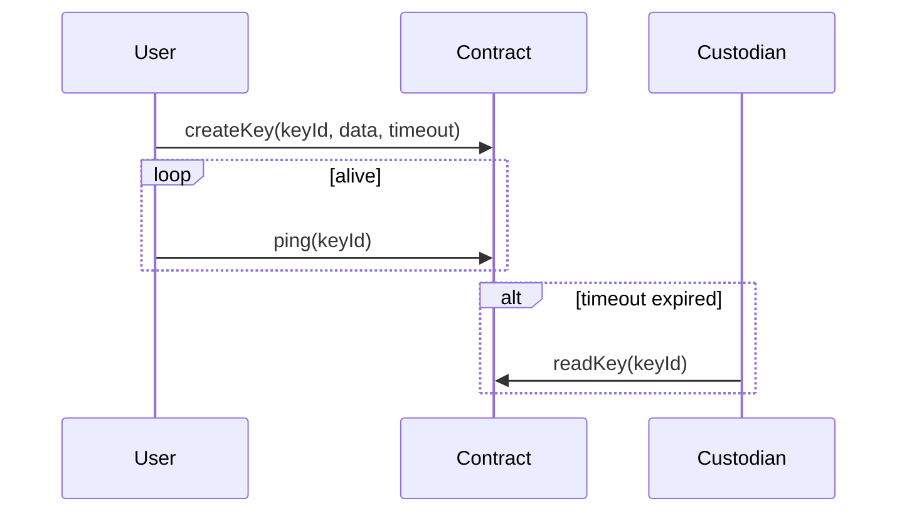

# 🧾 Zaphenath White Paper

> A secure, time-based data release protocol powered by smart contracts.

## 1. Introduction

Zaphenath is a smart contract protocol designed to securely store encrypted data and release it based on user-defined inactivity timeouts. Its core objective is to provide conditional data disclosure mechanisms for sensitive information such as digital wills, contingency business plans, or legal arrangements.

The protocol enables key owners to assign access permissions to external users ("custodians") based on roles and ping activity. Once the defined timeout passes without a ping from the key owner or designated proxy, the encrypted data becomes accessible to specified custodians.

Zaphenath combines smart contract automation, access control delegation, and cryptographic enforcement of inactivity conditions into a single, auditable protocol.

## 2. Problem & Motivation

### 2.1 The Problem

Sensitive information, such as final wishes, internal corporate knowledge, or legal claims, often requires access _only_ when the original holder is inactive, incapacitated, or deceased. Traditional systems lack:

- **Automatic release mechanisms**
- **Verifiability and transparency**
- **Cryptographic integrity and decentralization**

### 2.2 Existing Solutions Fall Short

- **Centralized services**: Depend on trust in institutions.
- **Legal arrangements**: Require physical intervention.
- **Cloud storage + access sharing**: Risk of early data leakage.

There’s no secure, decentralized, and programmable solution for time-gated disclosure based on user inactivity.

## 3. Zaphenath Solution Overview

Zaphenath implements a timeout-driven key management system:

1. A user creates a key, associates it with encrypted data, and configures a timeout window.
2. As long as the user "pings" periodically, the data stays private.
3. If the timeout passes with no ping, custodians with appropriate roles can access the data.

### Key Features

- **Per-owner key isolation**
- **Role-based access control**: `Owner`, `Writer`, `Reader`, `None`
- **Per-user `canPing` flag**
- **Custodian delegation and revocation**
- **Readability toggle before timeout**

### Innovation Highlights

- **Trustless liveness signaling** without relying on external oracles
- **Time-conditioned encryption** with programmable release
- **Modular role enforcement per key instance**
- **Non-custodial delegation model** using self-custody-compatible logic

## 4. Why Blockchain?

### 4.1 Trustless Timekeeping

Smart contracts ensure:

- Transparent enforcement of ping/timeout logic
- Immutability of time-based state transitions

### 4.2 Decentralized Custody

By using Ethereum-compatible networks, Zaphenath avoids reliance on any single authority or infrastructure.

### 4.3 On-chain Access Logic

Every access, update, or ping action is verified, logged, and timestamped, offering traceability and auditability.

### 4.4 Compatibility with Decentralized Storage

Zaphenath stores only encrypted pointers or data references, which can integrate seamlessly with:

- IPFS
- Arweave
- Encrypted S3 buckets

This hybrid model enables scalable and private storage without bloating on-chain data.

## 5. Technical Architecture

### 5.1 Core Contracts

- `Zaphenath.sol`: Entry point and state manager
- `KeyData`: Stores encrypted content, timeout metadata, and access maps
- `Custodian`: Encodes a user’s role and ping rights
- `Role`: Enum of access levels

### 5.2 Data Flow

### 5.3 Ping Mechanism

Pings reset the `lastPing` timestamp. Timeout enforcement compares `block.timestamp - lastPing` against the `timeout`.

### 5.4 Access Rules

- Roles are enforced using `onlyRoleOrAbove()`
- Owner always bypasses role checks
- Custodian access requires explicit role + `canPing` (if sending ping)

### 5.5 Gas & Storage Considerations

- Each key creates a new storage mapping under a derived `bytes32` key.
- Role and ping rights use compact structs for efficient access.
- All data is stored as opaque `bytes` allowing for encrypted payloads of any format.

## 6. Use Cases

| Use Case                   | Description                                                     |
| -------------------------- | --------------------------------------------------------------- |
| **Digital Will**           | Keys released to heirs after owner inactivity                   |
| **Business Fallbacks**     | Keyholders can access credentials or policies upon team absence |
| **Dead Man's Switch**      | Secrets become readable if not reset within specified interval  |
| **Multi-party Disclosure** | Share read rights among multiple stakeholders post-timeout      |
| **Posthumous DAO Voting**  | Reveal final votes after wallet inactivity period               |
| **Time-locked Research**   | Delay release of intellectual property or publications          |

## 7. Roadmap

| Phase       | Timeline   | Deliverables                                    |
| ----------- | ---------- | ----------------------------------------------- |
| MVP         | ✅ Q2 2025 | Smart contract suite, tests, deploy scripts     |
| Docs & Site | ✅ Q2 2025 | MkDocs reference, README, changelog             |
| Audit       | Q3 2025    | Static analysis, formal verification            |
| UI Portal   | Q4 2025    | DApp for key creation, pinging, and read access |
| DAO/Grants  | Q1 2026    | Community governance & integrations             |

## 8. Team

Zaphenath is developed by contributors at **Astervia**, a research collective building decentralized infrastructure for privacy-respecting automation.

- **Ruy (Rfluid) Vieira** – Lead Solidity Engineer  
  Architect of Zaphenath's smart contract infrastructure, with deep expertise in cryptographic protocols, distributed systems, and automation logic.

- **Pedro Caninas** – Head of Business Development & Strategic Alliances  
  Leads external relations, partner ecosystems, and product-market fit strategy across legaltech, DAO tooling, and digital estate infrastructure.

- **João Victor Zaniboni** – Director of Strategy & Ecosystem Growth  
  Drives long-term vision, funding alignment, governance modeling, and cross-sector adoption of Zaphenath across web3 and institutional platforms.

## 9. Marketing & Community Strategy

- Open-source and donation-based sustainability model
- Community support via GitHub Discussions
- Long-form educational content and walkthroughs
- Targeting legaltech, DAOs, NGOs, and decentralized infrastructure builders
- Consulting packages for legal teams, death-tech startups, and custody protocols

## 10. Safety Considerations: Time Oracle Desync

Zaphenath relies on `block.timestamp` as a time oracle to enforce timeout conditions. While this is a standard and generally reliable approach in Solidity, it is subject to miner manipulation within a limited range (~±15 seconds).

### Potential Attack: Timestamp Skewing

An adversarial miner or validator could attempt to advance or delay the block timestamp to:

- Trigger premature timeout (disclosing data early)
- Delay timeout enforcement (preserve secrecy longer than intended)

### Safety Measures

- The protocol enforces **reasonable timeout durations** (recommended ≥ 1 day), which mitigates the impact of ±15s drift.
- **High-resolution pings (e.g., hourly)** are not recommended in high-risk use cases.
- The contract assumes **honest-majority consensus** in L1 or L2 block production.
- Users should avoid critical decisions based on near-expiry timeout margins.

### Developer Recommendations

- Use block explorers or simulation tools to validate timeout behaviors.
- For mission-critical deployments, consider future support for **cross-chain oracles** (e.g., Chainlink) to confirm liveness.

## 11. Future Directions

### Cross-Chain Interoperability

Zaphenath can be adapted to operate on multiple chains with standardized time signaling across rollups, sidechains, and L1s.

### Zero-Knowledge Enhancements

- zkPing proofs to allow off-chain proof of liveness without sending an on-chain transaction
- zkAccess for conditional disclosure without revealing custodian addresses

### Social Recovery

Planned integration with social recovery frameworks to allow delegated key reactivation via quorum-based pinging.

### DAO Module

An optional module for DAOs to use inactivity-triggered data exposure to enforce proposals, time-locked voting, or treasury disclosures.

## 12. Conclusion

Zaphenath brings a novel approach to on-chain data custody. By tying access logic to ping-based activity, it creates a programmable mechanism for conditional release — ideal for high-trust, time-sensitive scenarios.

It is:

- Minimal by design
- Secure through enforced roles
- Extensible via custom custody policies

**Join us in building verifiable trust at rest.**
